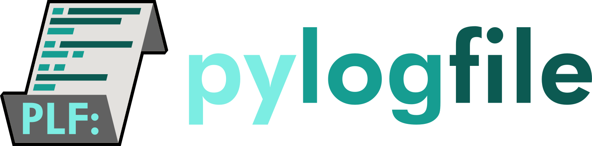

**pylogfile** is an open source, BSD-licensed package for generating rich logs in Python. Pylogfile 
enables log messages to be more useful than traditional logs by embedding markdown, optional 
sub-messages including additional details, timestamps, and log levels. It also provides ways to save
the logs in JSON or HDF formats, with HDF providing a compact binary representation. Furthermore,
the included `lumberjack` script allows log files to quickly be summarized, sorted and searched!

Documentation
=====================================

.. toctree::
    :maxdepth: 2
    
    tutorials/index.rst
    pylogfile
    license
    

Indices and tables
==================

* :ref:`genindex`
* :ref:`modindex`

.. _pylogfilehome: https://github.com/Grant-Giesbrecht/pylogfile/